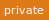
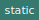

# Module `@fizz/package-module-name`

package-module-name module.

[Source file](../src/main.js)

## Functions

### `packageModuleName#_init(containerId, menuFileName)`

 

Initializes the module and calls the different methods in order.

Parameters | Type | Description
--- | --- | ---
__containerId__ | `string` | *The id of an element that content will be inserted in.*
__menuFileName__ | `string` | *The URL and filename of the menu file with an array of objects.*

---

### `packageModuleName#_loadMenuByFilename(menuFileName) ► Array.<Object>`

 

Finds and loads menu in JSON format based on file name.

Parameters | Type | Description
--- | --- | ---
__menuFileName__ | `string` | *The URL and filename of the menu JSON file.*
__*return*__ | `Array.<Object>` | *The menu file.*

---

### `packageModuleName#_makeDropdown(containerEl, menu)`

 

Populates a set of options for a dropdown (&#x60;select&#x60;) element.

Parameters | Type | Description
--- | --- | ---
__containerEl__ | `Element` | *The element to hold the dropdown.*
__menu__ | `Array.<Object>` | *The file with the list of menu categories to populate the dropdown.*

---

### `packageModuleName#_showMenuItems(event)`

 

Creates details element with optional event listener.

Parameters | Type | Description
--- | --- | ---
__event__ | `Event` | *A change event from a &#x60;select&#x60; element.*

---

### `packageModuleName#_makeSummaryItem(content, classname) ► Element`

 

Creates a span element, inserts content into it, and adds an optional classname.

Parameters | Type | Description
--- | --- | ---
__content__ | `string` | *The string or element to insert into the &#x60;span&#x60; element.*
__classname__ | `string` | *The name of the CSS class to add, if any.*
__*return*__ | `Element` | *A &#x60;span&#x60; element with the content and classname.*

---

# Class `packageModuleName`

Class demonstrating module and packaging use.
Given a container and the URL to a menu in an array of objects, creates a dropdown for each category of food, and a list of twisties of each dish.
